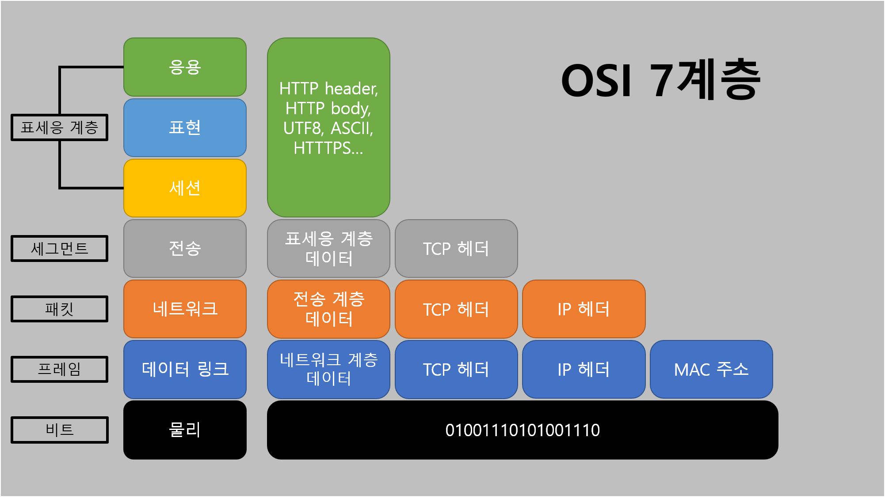
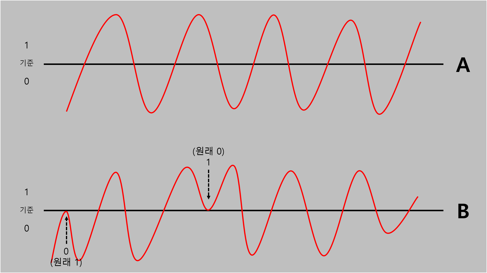
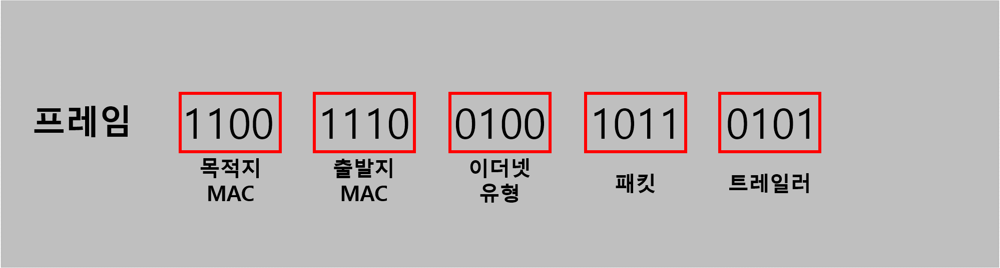
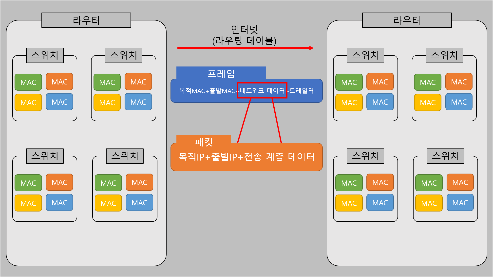
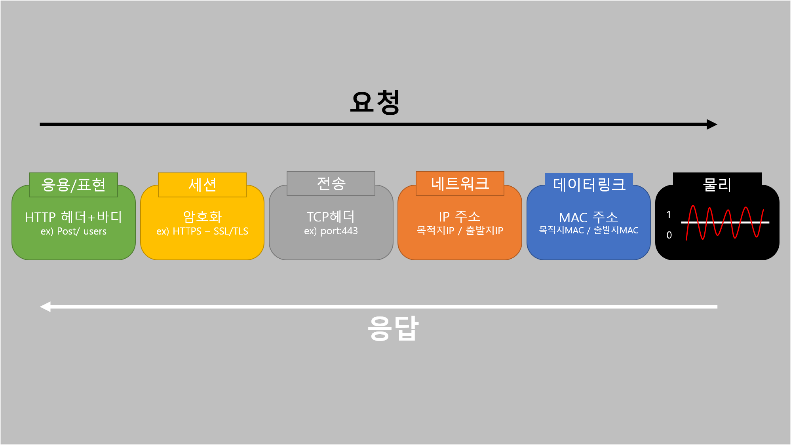
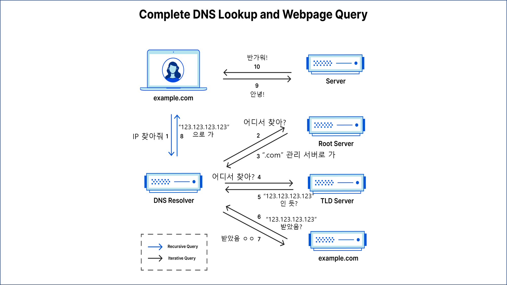

# [TIL 4] - [CS] OSI 7계층

## OSI 7계층

통신 과정을 7계층으로 나누어 기능을 정의하고 표준화한 모델이다.

>  > **OSI 7계층 이미지**

## 물리 계층 (L1)

`랜카드`를 통해 전기 신호를 비트로, 또는 비트를 전기 신호로 변환하여 전송하는 계층이다. (아날로그 ↔ 디지털)

>  > **랜카드** 고유한 ID를 가지고 있음.

전기 신호의 일정 부분에 기준을 두고, 위쪽은 `1`, 아래쪽은 `0`으로 판단하기도 한다.

>  > **전기 신호**

그림 `B`처럼 애매하게 신호가 들어와 의도한 대로 반영되지 않을 때를 대비해 `패리티 비트(검증 코드)`를 추가한 검증 단계를 거쳐 수정한다.

## 데이터 링크 계층 (L2)

목적지 `MAC` 주소와 출발지 `MAC` 주소 등을 포함한 `프레임(frame)`을 구성한다.

>  > **프레임**

`MAC` 주소는 `OO-OC-29-6C-FJ-ES` 같은 형태인 랜카드의 *고유 ID*값이다.

출발지 `MAC`은 내 주소로 확실하지만, 타인의 `MAC` 주소는 어떻게 알아낼 수 있을까? 방법은 마치 케빈 베이컨의 6단계처럼 옆 `MAC`에 물어물어 찾는다. `스위치 ➡ 라우터 ➡ 인터넷 ➡ 라우터 ➡ 스위치` 식이다.

유선은 `이더넷(Ethernet)` 프로토콜을 따라 목적지를 찾고, 무선은 `WIFI(Wireless Fidelity)` 프로토콜을 따라 `AP(Access Point)`를 목적지로 향한다.

## 네트워크 계층 (L3)

`IP(Internet Protocol)`을 주소로 하여 패킷을 전송하는 계층이다.

종류로는 `IPv4`와 `IPv6`가 있다.

`IPv4`는 **32bit**로, `0.0.0.0` ~ `255.255.255.255`까지를 사용한다. 그러나 그 양이 현재 불충분하여(`256⁴ ≒ 43억`) `IPv6`가 새로 적용되었다. `IPv6`는 **128bit**이며 `43억⁴`이므로 부족할 수가 없는 구조이다. 형태는 `0db8:85a3:08d3:1319:8a2e:0370:7334`로 되어 있다.

또한, `IPv4`는 **공인 IP**와 **사설 IP**로 나뉜다. 전자는 통신이 가능하고, 후자는 통신을 할 수 없다. `10`, `172.16~172.31`, `192.168`로 시작하는 것이 **사설 IP**이며, 특히 `192.168`로 시작한다면 집안 내 어떤 기기의 주소일 확률이 높다.

>  > **패킷**

`MAC`주소처럼 목적지 `IP` 역시 옆 **라우터**에 물어 알아낸다. **라우팅 테이블**은 경로 찾는 역할을 한다.

## 전송 계층 (L4)

전송 계층은 `포트(port)`를 이용해 표세응 계층과 연결하고, `TCP/UDP` 프로토콜을 이용하여 데이터를 전송한다.

`포트`는 IP 뒤에 `:80`식으로 붙인다. 대표적인 포트로는 `80 - HTTP`, `443 - HTTPS`, `22 - SSH`, `53 - DNS` 등이 있다. 특히 `0 ~ 1023` 포트는 `Well Known Port(잘 알려진 포트)`라고 하여, 이미 어디서 쓰고 있을 수 있으므로 사용하지 않는 것이 좋다.

전송 프로토콜 중 `TCP`는 **3way handshake**를 사용하여 네트워크를 연결하고 응답을 확인한다. 하지만 데이터를 일일이 확인하느라 속도가 느리고, 확인 절차가 포함되어 데이터 양이 많다. `TCT 헤더 + 세션 계층 데이터`를 **세그먼트**라고 한다. `HTTP 1.1`과 `HTTP 2`가 `TCP`에 해당한다.

>  > **3way handshake**

`UDP`는 확인 절차 없이 네트워크가 연결되면 일방적으로 데이터를 보낸다. 제대로 받았는지 확인하지 않아 속도가 빠르다. 주로 정확성이 중요하지 않은 멀티 미디어 전송에 사용한다. `UDP 헤더 + 데이터`를 **데이터그램**이라고 하며, `HTTP 3`가 `UDP`에 해당한다.

## 세션·표현·응용 계층 (L7)

`HTTP 헤더(header)`와 `HTTP 본문(body)`에 해당하며, 데이터를 실질적으로 나타낸다. 보통 `세션 계층`에서 **암호화**를, `표현 계층`에서 **확장자**를, `응용 계층`에서 **HTTP**를 담당하지만, 정확히 분류되지는 않는다. 프로그램에 따라 구성되기 때문이다.

>  > **간략한 데이터 흐름 예시**

데이터 요청은 `세표응 계층`에서 내용을 작성하고 암호화한 후 `전송 계층`에서 목적지 포트를 추가한다. `네트워크 계층`에서는 목적지 IP와 출발지 IP를, `데이터 링크 계층`은 목적지 MAC과 출발지 MAC을 더한다. 그 후 `물리 계층`에서 전기 신호로 변환하여 요청한다. 응답은 역순으로 하여 데이터를 받는다.

## 데이터 흐름 총 정리

내 컴퓨터에서 특정 컴퓨터로 데이터를 전송한다고 하자. 예를 들어, 목적지가 `Naver`라면, 다음과 같이 요청 데이터를 구성한다. 여기서 목적지 IP는 `DNS(Domain Name System)`를 통해 획득한다.

|       목적지 MAC       | 출발지 MAC | 목적지 IP | 출발지 IP | 목적지 Port | 출발지 Port | HTTP 요청 | 트레일러 |
| :--------------------: | :--------: | :-------: | :-------: | :---------: | :---------: | :-------: | :------: |
| 내 네트워크 라우터 MAC |   내 MAC   | Naver IP  |   내 IP   |     443     |   내 Port   |     -     |    -     |

`내 네트워크 라우터`에 도착하면 목적지/출발지 MAC을 교체한다.

|         목적지 MAC          |        출발지 MAC        | 목적지 IP | 출발지 IP | 목적지 Port | 출발지 Port | HTTP 요청 | 트레일러 |
| :-------------------------: | :----------------------: | :-------: | :-------: | :---------: | :---------: | :-------: | :------: |
| _Naver 네트워크 라우터 MAC_ | _내 네트워크 라우터 MAC_ | Naver IP  |   내 IP   |     443     |   내 Port   |     -     |    -     |

라우터는 출발지 IP도 잠시 떼었다가 수정해서 붙이는데, `사설 IP`를 `공인 IP`로 교체하는 작업이다. `Naver 네트워크 라우터 MAC`에 도착하면 다시 목적지 MAC을 `Naver MAC`으로, 출발지 MAC을 `Naver 네트워크 라우터 MAC`로 교체한다. 출발지 IP는 Naver 라우터 사설 IP로 변경된다.

최종 목적지에 도착하면 Naver 컴퓨터가 요청만 남기고 나머지를 제거한다. 데이터를 읽고, 응답 HTTP 메세지를 작성해 전송하며, 이는 역순으로 전달된다.

## DNS와 레코드

IP 주소 획득에 도움을 주는 `DNS`는 **전화번호부의 인터넷 주소 버전**이다. 외우기 어려운 IP 주소를 도메인으로 만들어 제공하고, 요청 시 해당 도메인을 IP 주소로 변경한다.

>  > **DNS 과정 의역**
>
> > 원본 출처 : <https://www.cloudflare.com/ko-kr/learning/dns/what-is-dns/>

내 나름대로 과정을 의역해 봤다. 이렇게 받아온 IP 주소는 정해진 시간 동안 캐시에 저장하고, 요청할 때마다 캐시에서 우선 찾아 응답한다.

`DNS 레코드`는 요청한 도메인의 IP 주소와 처리 방법에 대한 정보를 제공한다. 일반적인 레코드의 종류와 역할은 [Cloudflare - DNS 레코드란 무엇입니까?](https://www.cloudflare.com/ko-kr/learning/dns/dns-records/)에서 가져왔다.

|    Record    |                                     Description                                     |
| :----------: | :---------------------------------------------------------------------------------: |
|   A 레코드   |                         도메인의 IP 주소를 갖고 있는 레코드                         |
| AAAA 레코드  |     도메인의 IPv6 주소를 포함하는 레코드(IPv4 주소를 나열하는 A 레코드와 반대)      |
| CNAME 레코드 | 하나의 도메인이나 하위 도메인을 다른 도메인으로 전달하며, IP 주소를 제공하지는 않음 |
|  MX 레코드   |                             이메일을 이메일 서버로 전송                             |
|  TXT 레코드  | 관리자가 레코드에 텍스트 메모를 저장할 수 있음.이 레코드는 종종 이메일 보안에 사용  |
|  NS 레코드   |                             DNS 항목의 이름 서버를 저장                             |
|  SOA 레코드  |                          도메인에 대한 관리자 정보를 저장                           |
|  SRV 레코드  |                           특정 서비스에 대한 포트를 지정                            |
|  PTR 레코드  |                         리버스 조회에서 도메인 이름을 제공                          |

---

**참고**\
[Inflearn ZeroCho - 비전공자의 전공자 따라잡기 - 네트워크, HTTP](https://www.inflearn.com/course/%EC%A0%84%EA%B3%B5%EC%9E%90-%EB%94%B0%EB%9D%BC%EC%9E%A1%EA%B8%B0-%EB%84%A4%ED%8A%B8%EC%9B%8C%ED%81%AC-http)\
[위키백과 - IPv6](https://ko.wikipedia.org/wiki/IPv6)\
[위키백과 - 핸드셰이킹](https://ko.wikipedia.org/wiki/%ED%95%B8%EB%93%9C%EC%85%B0%EC%9D%B4%ED%82%B9)
[@gndan4 - [네트워크] 데이터 링크 계층](https://velog.io/@gndan4/%EB%84%A4%ED%8A%B8%EC%9B%8C%ED%81%AC-%EB%8D%B0%EC%9D%B4%ED%84%B0-%EB%A7%81%ED%81%AC-%EA%B3%84%EC%B8%B5)\
[Cloudflare - DNS란 무엇입니까?](https://www.cloudflare.com/ko-kr/learning/dns/what-is-dns/)\
[Cloudflare - DNS 레코드란 무엇입니까?](https://www.cloudflare.com/ko-kr/learning/dns/dns-records/)
