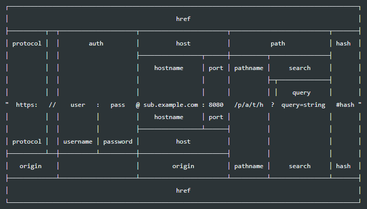

# [TIL 6] - [CS] 크롬 개발 도구 네트워크 탭, HTTP RFC, 주소체계

## 크롬 개발 도구 네트워크 탭

- `크롬 ➡ 검사 ➡ 네트워크`로 볼 수 있음
  - `검사`는 `오른쪽 마우스 클릭 ➡ 검사` or `ctrl + shift + i`로 켤 수 있음
- 캐시 비활성화 후 보기 ➡ 캐시 여부에 따라 차이가 크다고 함
- `header` : 요청 및 응답 헤더 확인
- `response` : 응답 body
- `payload` : 요청 body
- `:{string}:` : HTTP 2 or HTTP 3

## HTTP RFC

- `RFC`는 인터넷 표준
- `HTTP Method`나 `header` 등에 대한 정보는 [`RFC 2616`](https://datatracker.ietf.org/doc/html/rfc2616)에서 확인 가능
  - but 1999년도에 나온 터라 [`RFC 7231`](https://datatracker.ietf.org/doc/html/rfc7231)로 업데이트 됨
  - 이보다 최신은 [`RFC 9110`](https://datatracker.ietf.org/doc/html/rfc9110)
- 현재 `RFC`보다 최신을 보려면 `Obsoleted by`를 참고
  - 없다면 최신 스펙
- `RFC`가 보기 어렵다면 [`MDN HTTP`](https://developer.mozilla.org/ko/docs/Web/HTTP) 문서를 보고 개념 익힌 후 접근하는 게 최적
- 참고하면 좋을 [`RFC 7231` 번역본](https://roka88.dev/106)

## 주소 체계

- `URL(Uniformed Resource Location)` : 자원의 위치
  - ex) http://example.com (프로토콜을 포함에 어떻게 도달할 수 있는지 위치까지 나타냄)
- `URI(Uniformed Resource Identifier)` : 자원을 식별하는 고유 문자열
  - ex) example.com (자원 이름만 나타냄)

- 가운데 주소를 기준으로, 과거에는 위쪽으로 구성요소를 파악했으나 최근에는 아래쪽을 사용하는 추세
- `query=string`까지는 서버에 도달하나, `hash`는 클라이언트에서만 보임

**참고**\
[Inflearn ZeroCho - 비전공자의 전공자 따라잡기 - 네트워크, HTTP](https://www.inflearn.com/course/%EC%A0%84%EA%B3%B5%EC%9E%90-%EB%94%B0%EB%9D%BC%EC%9E%A1%EA%B8%B0-%EB%84%A4%ED%8A%B8%EC%9B%8C%ED%81%AC-http)\
[`RFC 2616`](https://datatracker.ietf.org/doc/html/rfc2616)\
[`RFC 7231`](https://datatracker.ietf.org/doc/html/rfc7231)\
[`RFC 9110`](https://datatracker.ietf.org/doc/html/rfc9110)\
[`MDN HTTP`](https://developer.mozilla.org/ko/docs/Web/HTTP)\
[이병록 - RFC 7231 - HTTP/1.1 : Semantics and Content 번역](https://roka88.dev/106)\
[이랜서 - URI와 URL, 어떤 차이점이 있나요?](https://www.elancer.co.kr/blog/view?seq=74)
