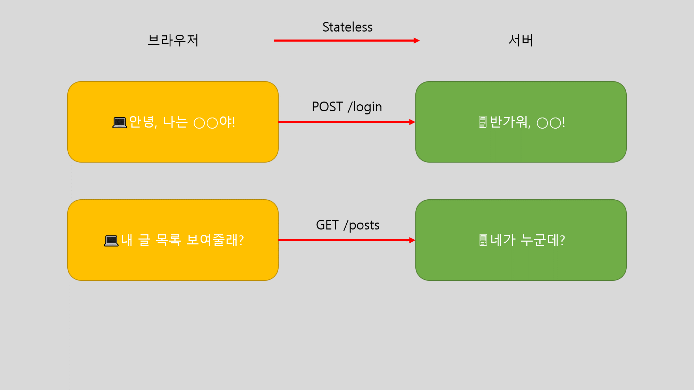
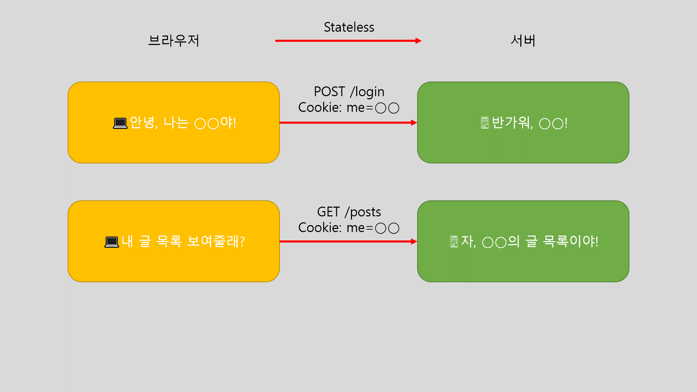

# [TIL 10] - [CS] Header - Cookie, Cache, 캐시 신선도 검사, CORS

## 쿠키(Cookie)

HTTP는 `Stateless`이기 때문에 서버에서 이전 요청을 기억하지 못한다. 예를 들어, 로그인을 하여 `Real-Bird`임을 알렸어도, 다음 요청에서 서버는 내가 `Real-Bird`인지 아닌지 모른다.

>  > **HTTP Stateless**

이전 요청을 활용해 데이터를 주고 받으려면 상태가 있어야 한다. 그러기 위한 방안으로 추가한 헤더가 `쿠기(Cookie)`이다. 브라우저와 서버는 `쿠키`를 이용해 요청자의 신분 등을 확인한다.

>  > **HTTP Stateless**

물론 쿠키가 만료되기 전까지 요청마다 전달하기 때문에 너무 길면 데이터가 낭비될 수 있다.

### 쿠키 속성

크롭 개발자 도구에서 `Application` 탭으로 이동하면 `Cookies` 항복에서 속성을 자세하게 볼 수 있다. 몇 가지만 살펴 보자.

#### Expires/Max-Age

쿠키가 만료되는 유효 기간을 나타내며, `Session`이라면 브라우저가 종료되는 즉시 만료된다. `Expires`는 쿠키가 만료되는 **서버 시간**을 의미하고, `Max-Age`는 만료 시간을 초단위로 환산한 시간을 나타낸다.

```
"Set-Cookie": "hello=world;Expires=Sat, 28 May 2023 10:59:21 GMT;Max-Age=3600;"
```

두 옵션 중 `Max-Age`가 더 높은 우선순위를 가진다. 혹여 서버 시간과 클라이언트 시간이 달라 유도한 것과 다를 수 있기 때문이다.

#### Domain

도메인과 일치하거나 서브 도메인만 쿠키를 사용할 수 있다.

예를 들어, 도메인이 `example.com`이고 `path`가 `/user`라면 `example.com/user`와 서브 도메인인 `api.example.com/user`는 가능하다. 하지만 도메인이 `api.example.com`이라면 `api.example.com/user`는 가능하지만, `example.com/user`는 불가능하다.

#### HttpOnly

자바스크립트에서 쿠키를 가져갈 수 있는지 여부를 설정한다. `true`라면 불가능하고, `false`라면 가능하다.

```
"Set-Cookie": "hello=world;HttpOnly=true"
```

콘솔에서 `document.cookie`로 확인할 수 있다.

```js
// HttpOnly=false
document.cookie; // 'hello=world'

// HttpOnly=true
document.cookie; // ''
```

#### Secure

프로토콜이 `HTTPS`일 때만 사용 가능하다. 단, `localhost`에서는 예외로 한다.

```
"Set-Cookie": "hello=world;Secure=true;"
```

#### Same Site

도메인이 달라도 쿠키를 보낼 수 있는지 여부를 설정한다. `Lax`가 기본값이며, 다른 값으로 `Strict`와 `None`이 있다.

`Lax`는 몇 가지 요청을 제외한 다른 도메인의 요청에 쿠키를 차단한다. `GET` 메서드를 사용하는 요청 중 `<a>`와 `<form method="GET">` 정도만 허용한다.

`Strict`는 도메인이 일치해야 만 쿠키를 전송한다.

`None`은 검증 없이 쿠키가 전송된다.

## 캐시(Cache)

요청마다 새 문서를 보내는 것은 데이터 낭비를 유발하기 때문에, 기존 데이터를 캐싱하여 저장하여 요청에 따라 캐시된 문서 혹은 신규 문서를 전송한다.

클라이언트에서 요청이 들어오면 먼저 저장소(DB, 메모리, 파일)에 캐시가 있나 확인한다. 이때 캐시가 있다면 `Cache Hit`라고 하고, 없다면 `Cache Miss`라고 한다.

### Cache Control

`Cache Hit`더라도 경우에 따라 대응이 다를 수 있다.

1. `Cache-Control: Max-Age`와 `Expires`가 만료 전이어서 캐시가 아직 신선한 경우, 기존 캐시를 보낸다. 여기서 `Expires`는 속성이 아닌 헤더명이다.
2. 캐시가 너무 오래된 경우,
   1. 서버에서 변경이 없을 때, 기존 캐시를 보낸다. (`304 Not Modified`)
   2. 서버에서 변경되었다면, 다시 새로 보낸다. (`200`)
   3. 그냥 오래된 기존 캐시를 보낸다.

`Cache Miss`라면 서버에서 새 데이터를 요청해 받는다.

#### 속성

- `max-age` : 캐시 저장 기간을 정한다. 초단위로 입력한다.
- `no-cache` : 캐시를 저장하되 항상 신선도를 검사한다. `Max-Age` 등을 무시한다.
- `no-store` : 캐시를 저장하지 않는다.
- `must-revalidate` : 유효 기간이 지나면 신선도를 검사한다. `Cache Hit`의 `2.3`에 대응하는 속성이다.
- `private` : 기본값으로, 캐시를 개인 것으로 저장한다.
- `public` : 캐시가 타인과 공유될 가능성이 생긴다. 단, `Authorization` 헤더와 함께 사용하면 `private`으로 변한다.
  `stale-while-revalidate`를 이용해 일단 오래된 캐시를 주고, 뒤에서 서버에 물어본 후 새 것이 있으면 몰래 업데이트한다.
- `stale-if-error` : 일단 오래된 캐시를 주고, 서버에서 에러가 발생했어도 오래된 캐시가 있으면 보낸다.

## 캐시 신선도 검사

캐시의 신선도를 알 수 있는 헤더는 마지막 수정 시간인 `Last-Modified`와 문서의 버전인 `ETag`가 있다. `ETag`는 `w/값`과 `값`이 있는데, 전자는 약한 검사로, 화면은 다르지만 핵심 내용이 같으면 동일하게 취급한다.

둘 모두 캐시가 서버 데이터와 같은지 판단하는 기준이 된다. 이 기준을 바탕으로 여러 해더를 통해 신선도를 검사한다.

- `If-Match` : `ETag` 값이 같으면 캐시를 가져온다.
- `If-None-Match` : 위와 반대로 동작한다.
- `If-Modified-Since` : 요청을 보낸 기간보다 마지막 수정한 시간이 최신이면 캐시를 가져온다. 오래되었다면 새 데이터를 요청한다.
- `If-Unmodified-Since` : 위와 반대로 동작한다.

만약 신선도를 검사하는 헤더가 여러 개 있다면, 모든 조건을 만족해야 동작한다.

## CORS(Cross Origin Resource Sharing)

다른 오리진에서 요청을 보내 자원을 공유하는 방식을 의미한다. 프론트쪽의 유명한 `CORS Error`의 주인공이다. 단, 해당 에러는 브라우저에서만 발생한다. 브라우저가 알아서 먼저 차단하기 때문이다.

`CORS`와 관련된 헤더는 `Access-`로 시작하는 헤더와 연관된다. 해당 헤더의 값을 서버에서 먼저 설정해줘야 브라우저에서 정상적인 요청을 보낼 수 있다.

오리진 설정 시 프로토콜, 포트, 서브 도메인이 달라지면 다른 오리진으로 인식함을 유의한다.

`GET`, `HEAD`, `POST` 메서드 중 하나와 `Accept`,
`Accept-Language`, `Content-Language`, `Content-Type`, `Range` 헤더만을 사용한 `simple requests`는 `Allow-Origin: *` 시 `CORS`를 트리거하지 않고 통과된다.

그 외의 `preflight` 요청은 좀 더 구체적으로 명시해야 한다.

> `preflight`란, 교차 출처 리소스 공유 사전 요청은 본격적인 교차 출처 HTTP 요청 전에 서버 측에서 그 요청의 메서드와 헤더에 대해 인식하고 있는지를 체크하는 것이다. [MDN - Preflight request](https://developer.mozilla.org/en-US/docs/Glossary/Preflight_request)

오리진이 허락되었다면, 브라우저에서는 `credentials`가 `include`여야 전달 가능하다.

위에서 `CORS` 에러는 브라우저서만 일어난다고 했는데, 이 말은 서버 간의 요청에서는 일어나지 않는다는 의미이다. 따라서 `브라우저`와 `다른 오리진 서버` 사이에 `브라우저와 같은 오리진 서버`를 두고 우회하면 에러가 발생하지 않는다. 이 중간 매개가 되는 서버 중 하나가 `프록시 서버`이다.

프론트엔드 개발자는 서버 개발을 잘 모르기 때문에 `webpack`에서 `webpack-dev-server`를 제공한다고 한다.

**참고**\
[Inflearn ZeroCho - 비전공자의 전공자 따라잡기 - 네트워크, HTTP](https://www.inflearn.com/course/%EC%A0%84%EA%B3%B5%EC%9E%90-%EB%94%B0%EB%9D%BC%EC%9E%A1%EA%B8%B0-%EB%84%A4%ED%8A%B8%EC%9B%8C%ED%81%AC-http)\
[HAHWUL - SameSite=Lax가 Default로? SameSite Cookie에 대해 정확하게 알아보기](https://www.hahwul.com/2020/01/18/samesite-lax/)\
[MDN - Set-Cookie](https://developer.mozilla.org/en-US/docs/Web/HTTP/Headers/Set-Cookie)\
[MDN - Cache](https://developer.mozilla.org/en-US/docs/Web/API/Cache)\
[MDN - Cross-Origin Resource Sharing (CORS)](https://developer.mozilla.org/en-US/docs/Web/HTTP/CORS)\
[MDN - Access-Control-Allow-Origin](https://developer.mozilla.org/en-US/docs/Web/HTTP/Headers/Access-Control-Allow-Origin)\
[MDN - Preflight request](https://developer.mozilla.org/en-US/docs/Glossary/Preflight_request)
