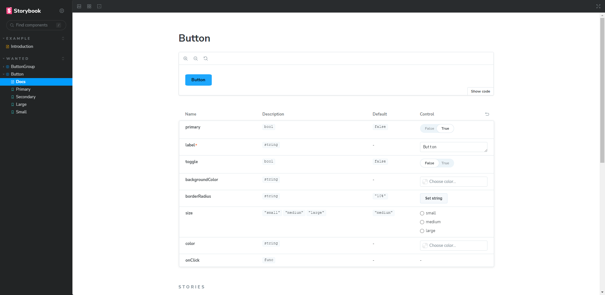

# [TIL 14] - [원티드 프리온보딩 FE 챌린지 6월] Day-3 참고

## 하향식 컴포넌트 개발(Top => Down)

1. 이미 만들어진 페이지 혹은 큰 단위의 컴포넌트를 하나하나 분리하여 계층 구성한다.
2. 컴포넌트를 만들 때 사용자가 보는 동일한 환경으로 개발한다.
   - 개발자가 아닌 사용자를 위해 개발하며 컴포넌트 분리한다.

## 상향식 컴포넌트 개발 (Bottom => Up)

1. 하나의 세트 구성한다.
   - ‼ 사용 **될** 컴포넌트 + CSS, 사용 **될** 스토리
2. 사용될 컴포넌트를 내보내고 스토리에서 사용될 컴포넌트를 가져온다.
   - `Component.jsx` 💕 `Component.stories.js`
3. 사용될 컴포넌트들은 `Storybook`이 무엇인지 모르게 만들어주는 게 좋다.
4. 다른 개발자에게 내 컴포넌트가 어떻게 사용될까 상상하며 개발하게 된다.

## Storybook

### Setup & Exec

- `npx storybook@latest init`으로 설치하고, `npm run storybook`으로 실행한다.

### 구성

- 기본적으로 샘플 코드가 담긴 `stories` 디렉토리를 제공된다.

```
src/
  └stories/
      ├─ Button.css
      ├─ Button.jsx
      ├─ Button.stories.jsx
      ├─ Header.css
      ├─ Header.jsx
      ├─ Header.stories.jsx
      ├─ Page.css
      ├─ Page.jsx
      └─ Page.stories.jsx
```

- 스타일링은 옵션이고, `Component`와 `Stories`가 하나의 세트로 구성된다.

### 커스텀 컴포넌트와 스토리

- 개인이 만든 커스텀 컴포넌트 역시 스토리를 추가하여 사용 가능하다.

```
src/
  └─ components/
       └─ Button/
            ├─ MyButton.css
            ├─ MyButton.jsx
            └─ MyButton.stories.jsx
```



#### MyButton.jsx

- 먼저 기본 제공되는 `Button.jsx`를 복사해 살펴보자.

```jsx
import PropTypes from "prop-types";
import "./MyButton.css";

export const Button = ({ primary, backgroundColor, size, label, ...props }) => {
  const mode = primary
    ? "storybook-button--primary"
    : "storybook-button--secondary";
  return (
    <button
      type="button"
      className={["storybook-button", `storybook-button--${size}`, mode].join(
        " "
      )}
      style={{
        backgroundColor,
      }}
      {...props}
    >
      {label}
    </button>
  );
};

Button.propTypes = {
  primary: PropTypes.bool,
  backgroundColor: PropTypes.string,
  size: PropTypes.oneOf(["small", "medium", "large"]),
  label: PropTypes.string.isRequired,
  onClick: PropTypes.func,
};

Button.defaultProps = {
  backgroundColor: null,
  primary: false,
  size: "medium",
  onClick: undefined,
};
```

- 여기서 사용하는 `PropTypes`는 **런타임 체킹 도구**로, `MyButton`이 가지는 `props`의 타입을 지정한다.
- `isRequired`를 적용하면 스토리북에서 필수값으로 인지하고 패널에 중요 표시를 한다.

#### MyButton.stories.jsx

- 기본 제공되는 `MyButton.stories.jsx`를 보자.

```jsx
import { Button } from "./MyButton";

export default {
  title: "Wanted/Button",
  component: Button,
  tags: ["autodocs"],
  argTypes: {
    backgroundColor: { control: "color" },
  },
};

export const Primary = {
  args: {
    primary: true,
    label: "Button",
    toggle: false,
  },
};

export const Secondary = {
  args: {
    label: "Button",
  },
};

export const Large = {
  args: {
    size: "large",
    label: "Button",
  },
};

export const Small = {
  args: {
    size: "small",
    label: "Button",
  },
};
```

- `default`에 담긴 정보가 스토리북에 그려진다. 여기에 나온 메타의 속성은 다음과 같다.

  - `title` : 스토리북의 컴포넌트 영역을 나누면서 이름을 정한다.
  - `component` : 스토리북에 그릴 컴포넌트이다.
  - `tags: ["autodocs"]` : 컴포넌트의 스토리를 요약한 문서를 생성한다.
  - `argTypes` : 패널에서 인자값을 조정할 수 있는 형태를 제공한다.
    - 예를 들어, `backgroundColor: { control: "color" }`은 색상을 *컬러 피커*나 *직접 입력*으로 설정할 수 있도록 한다. `string`으로 바꾸면 문자열을 입력하게끔 변경된다.

- 아래에 `export`하는 객체는 버튼의 종류를 구분한다. 현재 4가지 종류의 버튼이 등록되어 있다.

## 추가로 알게 된 참고용 사이트

- Vanilla Extract : https://vanilla-extract.style/
  - Zero Runtime CSS in JS -> 빌드 과정에서 js를 css로 변환
- 디자인 셋업 툴 : https://github.com/dry-frontend/dry-design-system
- react-hookz/web : https://github.com/react-hookz/web
  - react계의 lodash
- storybook의 다양한 디자인 : https://github.com/storybookjs/design-system
- 개발자 취업 치트키 원티드 아티클 : https://www.wanted.co.kr/events/series_78
- React 초기 네이버 메일 적용기 : https://d2.naver.com/helloworld/4966453
- top level await : https://github.com/tc39/proposal-top-level-await
