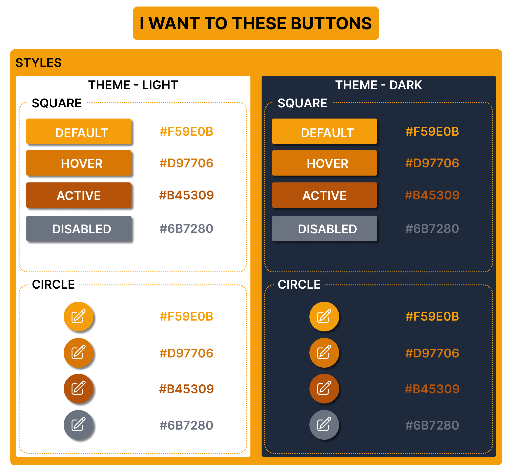
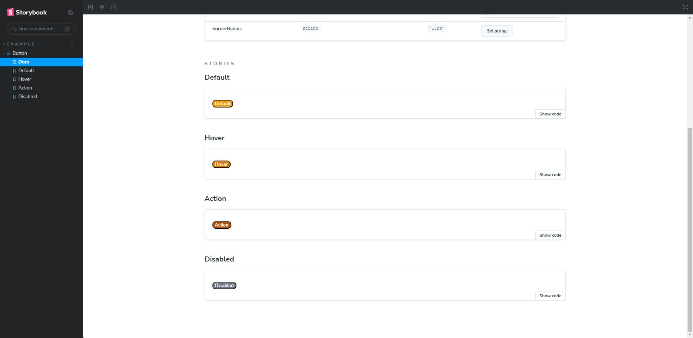

# [TIL 16] - [원티드 프리온보딩 FE 챌린지 6월] Day-4 참고

## 우리가 사용할 앱을 위한 라이브러리 만들기 with storybook

### 1. 라이브러리로 '사용될' 저장소 만들기

- 적당한 라이브러리 이름을 짓고 폴더를 만든다.
- 여기서는 `@real-bird/cdd-wanted`로 만들었다.

### 2. npm 환경 초기화

- `node` 환경을 사용하기 위해 `npm init` 명령어로 초기화한다.
- `npm init -y`를 입력하면 패키지를 일일이 설정할 필요없이 `package.json`이 생성된다.

```
# current dir tree

@real-bird/cdd-wanted/
    └─ package.json
```

### 3. Storybook 설치

- CDD에서 명세를 설정하기 위한 `storybook`을 설치한다.
  - `npx storybook@latest init`
- 컴포넌트 제작 환경은 익숙한 `react`로 선택했다.
- `vite`와 `webpack5` 환경 중 `react-webpack5`로 설치한다.
  - `storybook vite`의 경우 별도의 설정을 해야 하는데 모르기 때문이다.

```
# current dir tree

@real-bird/cdd-wanted/
    ├─ .storybook/
    │   ├─ main.js
    │   └─ preview.js
    ├─ node_modules/
    ├─ stories/
    ├─ package-lock.json
    └─ package.json
```

### 3. 스타일링 라이브러리 설치

- 여기서는 `CSS-in-JS` 라이브러리인 `styled-components`를 설치했다.
  - `npm install styled-components@latest`
  - 현재 버전업의 베타가 있어 라이브러리명 끝에 정확한 버전을 명시해야 한다. 안그러면 오류가 난다.
  - `latest` 버전은 `6.0.0-rc.3`이다.

### 4. 불필요한 스토리북 파일 제거

- 입맛에 맞게끔 디렉토리와 파일을 수정한다.
- 테스트용이므로 버튼 하나만 남기고 나머지는 제거했다. 디렉토리 역시 `stories`를 `src/components`로 바꿨다.

```
# current dir tree

@real-bird/cdd-wanted/
    ├─ .storybook/
    │   ├─ main.js
    │   └─ preview.js
    ├─ node_modules/
    ├─ src/
    │   └─ components/
    │       ├─ Button.jsx
    │       └─ Button.stories.jsx
    ├─ package-lock.json
    └─ package.json
```

### 5. 스토리북 디렉터리 경로 수정 후 config 반영

- 디렉토리와 파일 구조를 변경했으므로, 설정 파일 역시 그에 맞게 변경해준다.

```js
// .storybook/main.js
const config = {
  // 기존의 ../stories/**/*.stories.@(js|jsx|ts|tsx)를 아래처럼 바꿨다.
  stories: ["../src/components/**/*.stories.@(js|jsx|ts|tsx)"],
  // (...)
};
export default config;
```

### 6. Button 수정

- 챌린지 사전과제로 작성했던 Figma 설정을 참고해 `<Button />`을 구성했다.



- `Button.jsx` 파일은 다음과 같다.

```jsx
import React from "react";
import PropTypes from "prop-types";
import { styled } from "styled-components";

const DefaultButton = styled.button`
  color: ${(props) => (props.color ? props.color : "#FFFFFF")};
  background-color: ${(props) =>
    props.backgroundColor ? props.backgroundColor : "#F59E0B"};
  border-radius: ${(props) => (props.borderRadius ? borderRadius : "10px")};
`;

export const Button = ({ color, backgroundColor, borderRadius, label }) => {
  return (
    <DefaultButton
      type="button"
      style={{ color, backgroundColor, borderRadius }}
    >
      {label}
    </DefaultButton>
  );
};

Button.propTypes = {
  color: PropTypes.string,
  backgroundColor: PropTypes.string,
  label: PropTypes.string.isRequired,
  borderRadius: PropTypes.string,
};
```

- `Button.stories.jsx`는 다음과 같다.

```jsx
import { Button } from "./Button";

export default {
  title: "Example/Button",
  component: Button,
  tags: ["autodocs"],
  argTypes: {
    backgroundColor: { control: "color" },
    color: { control: "color" },
    borderRadius: { control: "text" },
  },
};

export const Default = {
  args: {
    label: "Default",
  },
};

export const Hover = {
  args: {
    label: "Hover",
    backgroundColor: "#D97706",
  },
};

export const Action = {
  args: {
    label: "Action",
    backgroundColor: "#B45309",
  },
};

export const Disabled = {
  args: {
    label: "Disabled",
    backgroundColor: "#6B7280",
  },
};
```

- `argTypes`의 명세는 [여기](https://storybook.js.org/docs/react/api/arg-types)서 확인할 수 있다.
- 설정을 마친 스토리북 화면이다.



- 다양한 색상의 버튼이 등록된 것이 보인다.

### 7. 번들러 'rollup' 설치

- 배포 전 번들링을 위해 `rollup`을 설치한다.
  - `npm install -D rollup`
- `webpack`보다 설정이 편하기 때문...인가? 사용 이유는 잘 모르겠다. 공부 필요

### 8. 진입점

- 설치 후 `rollup.config.js`를 생성해 진입점(entry)을 설정한다.
- [공식 문서](https://rollupjs.org/command-line-interface/)에 나온 설정을 복사해서 붙여넣었다.

```js
export default {
  input: "src/index.js",
  output: {
    file: "bundle.js",
    format: "cjs",
  },
};
```

- 진입점은 `src/index.js`로 설정하고, `ESmodule`을 사용하기 위해 `package.json`에 `"type": "module"`을 추가한다.

### 9. esbuild 설치

- `ESM`과 `CommonJS modules`를 번들링하기 위해 `esbuild`를 설치한다.

  - `npm install --save-exact -D esbuild`
  - `npm install rollup-plugin-esbuild`

- `rollup.config.js`에 플러그인을 추가한다.

```js
import esbuild from "rollup-plugin-esbuild";

export default {
  input: "src/index.js",
  output: {
    file: "bundle.js",
    format: "cjs",
  },
  plugins: [
    esbuild({
      include: /\.jsx?$/,
      minify: process.env.NODE_ENV === "production",
      jsx: "automatic",
    }),
  ],
};
```

### 10. peerDeps 설정

- 라이브러리 사용에 꼭 필요한 의존 관계를 `package.json`의 `peerDependencies`에 추가한다. 여기서는 `react`, `react-dom`, `styled-components`가 필요하다.

```json
{
  // (...)
  "peerDependencies": {
    "react": "^18.2.0",
    "react-dom": "^18.2.0",
    "styled-components": "^6.0.0-rc.3"
  }
}
```

- `rollup.config.jf`의 `external`에 번들링 제외할 peer-deps 라이브러리들을 추가한다.

```js
import esbuild from "rollup-plugin-esbuild";

export default {
  input: "src/index.js",
  output: {
    file: "bundle.js",
    format: "cjs",
  },
  plugins: [
    esbuild({
      include: /\.jsx?$/,
      minify: process.env.NODE_ENV === "production",
      jsx: "automatic",
    }),
  ],
  external: ["react", "react-dom", "styled-components"],
};
```

### 11. ESM, CJS output 설정 변경

- `ESM`과 `CJS` 두 모듈 모두 번들링하기 위해 `rollup.config.js`의 `output`을 변경한다.

```js
import pkg from "./package.json" assert { type: "json" };

export default {
  input: "src/index.js",
  output: [
    {
      file: pkg.exports["."].import,
      format: "cjs",
    },
    {
      file: pkg.exports["."].require,
      format: "esm",
    },
  ],
  // (...)
};
```

- `package.json`에도 `exports`를 추가한다.

```json
  "exports": {
    ".": {
      "import": "./dist/esm/index.js",
      "require": "./dist/cjs/index.js"
    }
  },
```

- `package`의 `exports`를 `config`에서 가져온 것이다. `assert` 문법은 `json`을 가져오는 `ESModule` 기능이다.

### 12. npm Login & npm 패키지명 중복 확인 & npm publish

- 만든 라이브러리를 npm에 배포하기 위해 먼저 로그인을 한다.
  - `npm login`으로 인증한다.
- `npm info 패키지명`으로 중복을 확인한다. 에러가 나면 중복되지 않은 패키지명이다.
- 빌드 결과물을 메인으로 수정하고, 배포 전 빌드 자동화를 추가했다.

```json
"main": "dist/esm/index.js",
"scripts": {
  "build": "rollup -c",
  "prepack": "rm -rf dist && npm run build",
},
```

- 빌드가 정상적으로 동작하면 `npm publish`로 배포한다.

  - 수정 사항이 있어 재배포해야 한다면, 버전을 바꿔야 한다. 버전이 같다면 `403` 에러가 발생한다.
  - 패키지를 삭제했으면 같은 이름의 패키지를 24시간 동안 사용할 수 없음에 주의하자.
  - 테스트 하느라 몇 번 삭제했더니 그냥 `npm publish`로는 에러가 발생했다. `private` 쓸 거면 돈을 내란다. `public`으로 설정하면 배포가 가능하다. `npm publish --access public`

- https://www.npmjs.com/package/@real-bird/cdd-wanted
- npm에 올린 결과물이다.

### 13. git repository

- 올리기 전에 <https://www.toptal.com/developers/gitignore>에서 환경에 맞는 ignore파일을 만든 후 추가한다. 여기서는 `node`만 써서 만들었다.

- 패키지스러운 `README`를 작성하자.

### 14. Storybook build

- 컴포넌트 문서화를 위해 Storybook도 빌드한다.
- 출력 디렉토리명을 바꾸기 위해 빌드 명령어에 다음을 추가했다.

```json
"build-storybook": "storybook build -o docs"
```

- `npm run build-storybook`으로 빌드한다.
- `package`의 버전을 하나 올리고 `npm publish`하면 `README`가 추가된 저장소를 볼 수 있다.

### 15. Github Pages에 Storybook 배포

- 빌드하여 만든 **Storybook docs**를 github pages로 배포한다.


1. 레포지토리의 **setting**탭으로 이동한다.
2. 왼쪽 패널에서 **pages**를 클릭한다.
3. **branch**를 변경한다. 여기서는 `main` 브랜치의 `docs`를 설정했다.

- 이후 상단의 **action**탭으로 이동해 보면 빌드되는 과정을 볼 수 있다. 주소가 나온다면 정상적으로 배포된 것이다.
- 나의 배포된 Storybook 페이지 : https://real-bird.github.io/test-cdd-wanted/

### 16. 사용할 라이브러리에서 배포한 npm 패키지 설치

- 배포된 패키지는 일반 라이브러리처럼 사용할 수 있다.
- `npm i @real-bird/cdd-wanted`로 설치해 본다.


- 잘 설치된 것이 보인다.
- 사용은 일반 라이브러리와 같다.


- 최종 화면이다.


