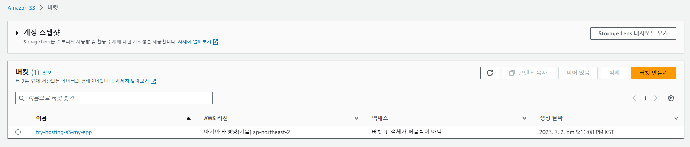

# [TIL 19] - [AWS] S3 정적 사이트 배포

## 1. AWS S3란

**S3**는 `Simple Storage Service`의 약자로, 파일을 저장하고 웹으로 접근할 수 있게 해주는 AWS 서비스 중 하나다. 저장에 초점을 맞춘 만큼 **정적 웹사이트** 호스팅을 손쉽게 할 수 있다.

호스팅 전에 간단하게 앱을 생성하고 빌드하여 정적 파일을 만들자. 빠른 설치를 위해 `vite`를 선택했다. [설치 참고](https://ko.vitejs.dev/guide/)

`npm install` 후 `build` 명령어를 실행하여 정적 파일을 생성한다. `vite`의 경우 `npm run preview`로 빌드 결과물을 실행한다.


## 2. S3 버킷 생성


오른쪽 **버킷 생성** 내 버튼을 눌러 새 버킷을 만든다.


`버킷 이름`은 전 세계에서 중복되지 않아야 한다. 알맞게 설정하자.

`AWS 리전`은 어느 지역에 있는 AWS 서버를 빌릴 것인지 정하는 것이다. 물리적인 거리가 가까울수록 속도가 빠르다. 가까운 지역으로 설정하자.

객체 소유권은 기본으로 두고 퍼블릭 액세스를 설정한다.


설정한다라고 했지만, 아직 서비스하지 않은 상태이므로 일단 모든 액세스를 차단해둔다. 보안의 기본은 전부 차단 후 필요한 것만 그때그때 여는 것이다. 추후 다시 만지도록 하자.

나머지 역시 기본 설정으로 두고 넘어간다. 최종 적으로 `버킷 만들기` 버튼을 누르면 생성된 버킷이 나온다.



### 2-TL;DR

- 버킷 만들기 누르고 `버킷 이름`과 `AWS 리전`을 설정한다.
- `버킷 이름`은 중복되지 않아야 한다.
- `AWS 리전`은 물리적 거리가 가까운 곳이 빠르다.

## 3. 정적 파일 업로드

배포를 위해서는 생성한 버킷 내에 정적 파일을 올려야 한다. `업로드` 버튼을 눌러 앞서 빌드한 결과물을 업로드한다.


여기서 주의할 점은 빌드된 폴더가 아니라 **_빌드 폴더 안의 파일_**을 올려야 한다는 점이다. 예를 들어, `vite`는 기본적으로 `dist` 폴더로 빌드되며, 이미지와 같이 그 안에 있는 내용물을 올려야 한다.


내용물을 추가하고 하단의 `업로드` 버튼을 누른다.


업로드에 성공하였다!

### 3-TL;DR

- 빌드 폴더가 아닌 빌드된 폴더 내의 내용물을 버킷에 업로드한다.

## 4. 접근 허용

배포된 앱의 주소로 접근하였을 때 `index.html`을 반환해주면 알아서 스크립트를 읽는다. 하지만 현재 주소로 들어가면 액세스가 거부된다. 이유는 위에서 `퍼블릭 액세스` 항목을 모두 차단해 놓았기 때문이다.

현재 버킷의 권한 탭에 들어가 퍼블릭 액세스를 설정한다.


`퍼블릭 액세스 차단`의 설정을 해제한다.


저장을 하게 되면 버킷이 퍼블릭해진다는 경고가 뜬다. 확인하고 넘어간다. `모든 퍼블릭 엑세스 차단`이 비활성화된 것을 볼 수 있다.

그러나 아직 퍼블릭 주소에 접근하지 못한다. `퍼블릭 엑세스 차단`을 해제한 것은 대문을 연 것에 불과하기 때문이다. 현관문을 열기 위해서는 누구나 접근할 수 있다는 권한을 추가로 설정해야 한다. 이것은 `버킷 정책`에 추가한다.


`버킷 정책` 편집에 들어가면 `JSON` 문법으로 정책을 추가하는 공간이 나온다. 기본 예제를 참고하여 정책을 추가한다. 참고한 코드는 [AWS S3 사용설명서#웹 사이트 액세스에 대한 권한 설정](https://docs.aws.amazon.com/ko_kr/AmazonS3/latest/userguide/WebsiteAccessPermissionsReqd.html)에서 확인할 수 있다.

```json
{
  // Version : 해당 날짜 시점에 정해진 문법을 적용한다.
  // 2012-10-17 버전이 기장 최신이다.
  "Version": "2012-10-17",
  // Statement : 정책 설정
  // 배열 내에 여러 청잭을 추가할 수 있다.
  "Statement": [
    {
      // 정책의 고유 id 지정
      // 자유롭게 지정할 수 있다.
      "Sid": "PublicReadGetObject",
      // 허용 or 거절 설정
      // Allow 와 Deny 두 가지가 있다.
      "Effect": "Allow",
      // 누구에게 정책을 적용할 것인가?
      // 모두에게 접근을 허용하므로 *(와일드카드) 사용
      "Principal": "*",
      // 어떤 행동을 허용할 것인가?
      "Action": [
        // 객체 접근
        "s3:GetObject"
      ],
      // 자원을 가져올 주소
      // 사용자의 버킷 이름을 추가하면 됨
      "Resource": ["arn:aws:s3:::Bucket-Name/*"]
    }
  ]
}
```

정책까지 저장하면 주소를 통해 접근할 수 있다. 하지만 홈에 랜딩했을 때 `index.html`이 보이는 건 좀 별로다. 이것을 기본 엔드포인트로 설정하기 위해서 `속성` 탭의 맨 아래에 있는 `정적 웹 사이트 호스팅` 설정을 수정한다.


`활성화`로 변경 후 `index.html`을 기본 페이지로 설정한다. 그러면 주소로 접근했을 때 `index.html`이 노출되지 않는다.

`오류 문서` 옵션을 설정하면 존재하지 않는 주소로 접근했을 때 리디렉션할 수 있다. 세세한 설정은 아래 `리디렉션 규칙`에서 관리할 수 있다.


### 4-TL;DR

- `권한` -> `퍼블릭 액세스 차단` 설정 해제
- `버킷 정책` 설정([참고](https://docs.aws.amazon.com/ko_kr/AmazonS3/latest/userguide/WebsiteAccessPermissionsReqd.html))
- `속성` -> `정적 웹 사이트 호스팅` -> `활성화 ✔` -> `인덱스 문서`에 `index.html` 설정
- `오류 문서` : 문제 발생 시 리디렉션 페이지 설정
- `리디렉션 규칙` : 세세한 리디렉션 관리

**참고**\
[AWS S3 사용설명서 - 정적 웹사이트 호스팅](https://docs.aws.amazon.com/ko_kr/AmazonS3/latest/userguide/WebsiteHosting.html)
