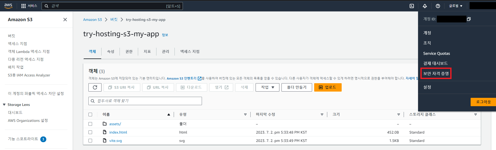
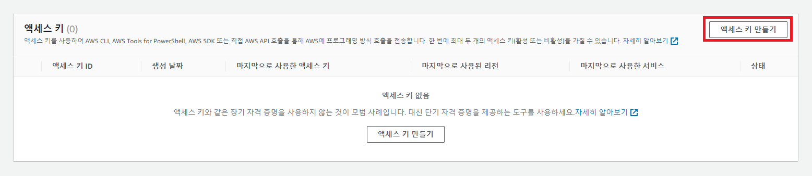
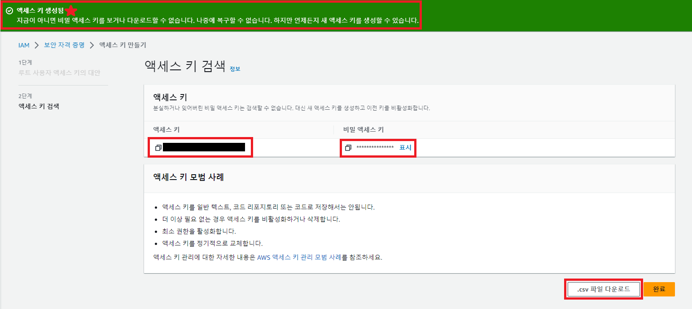
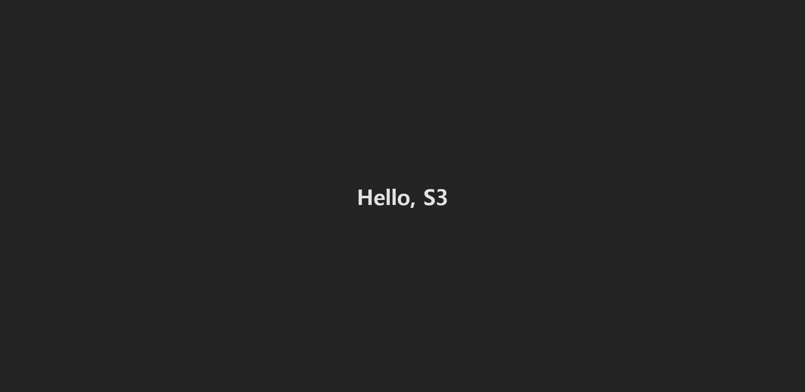
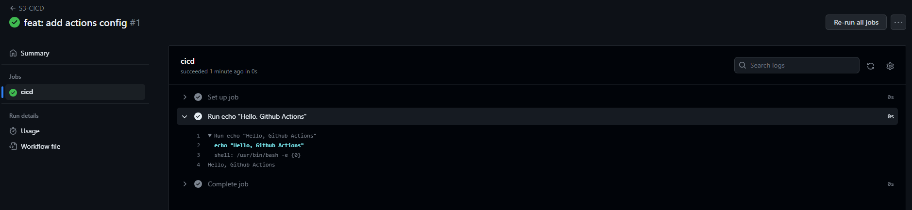
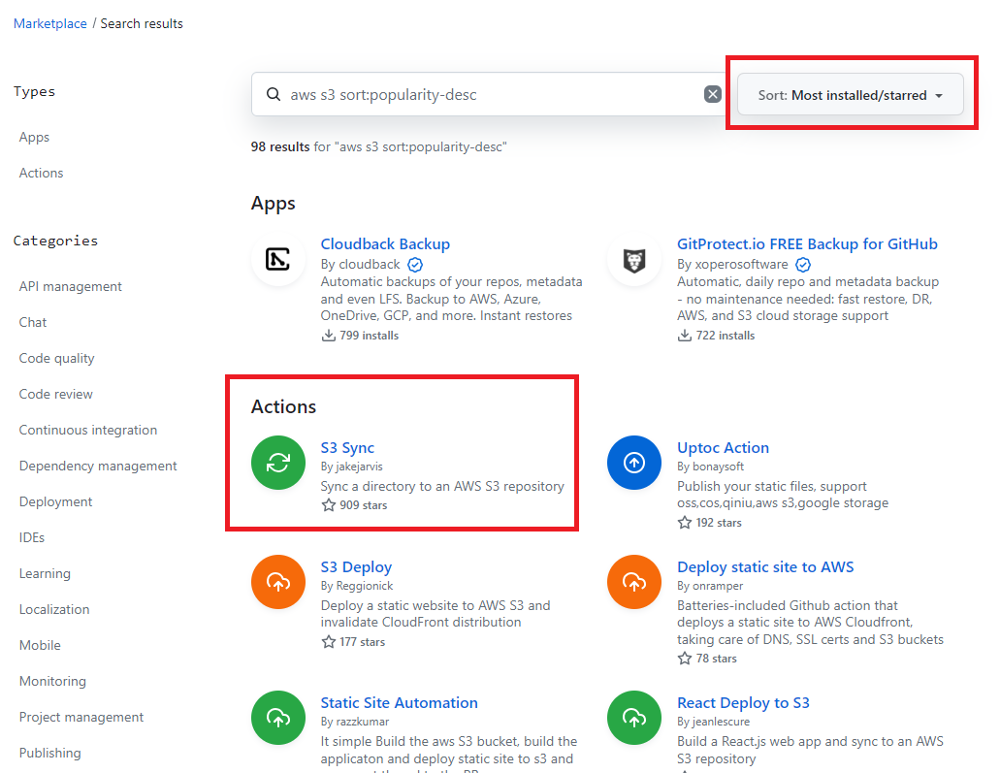
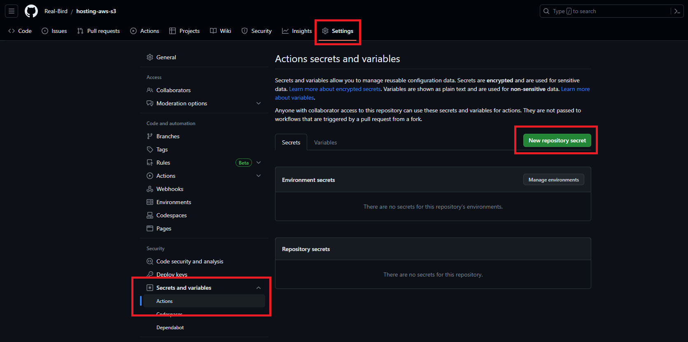
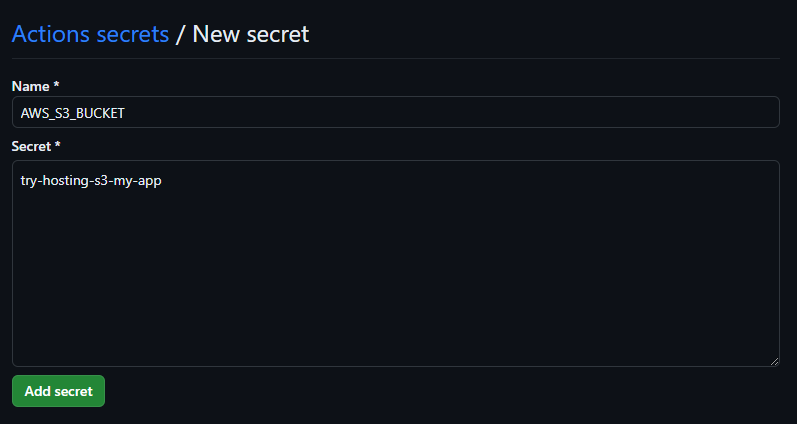
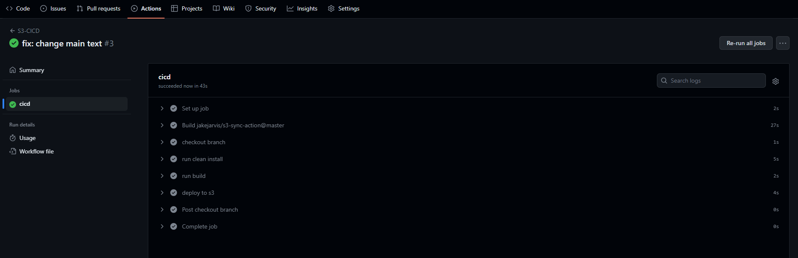
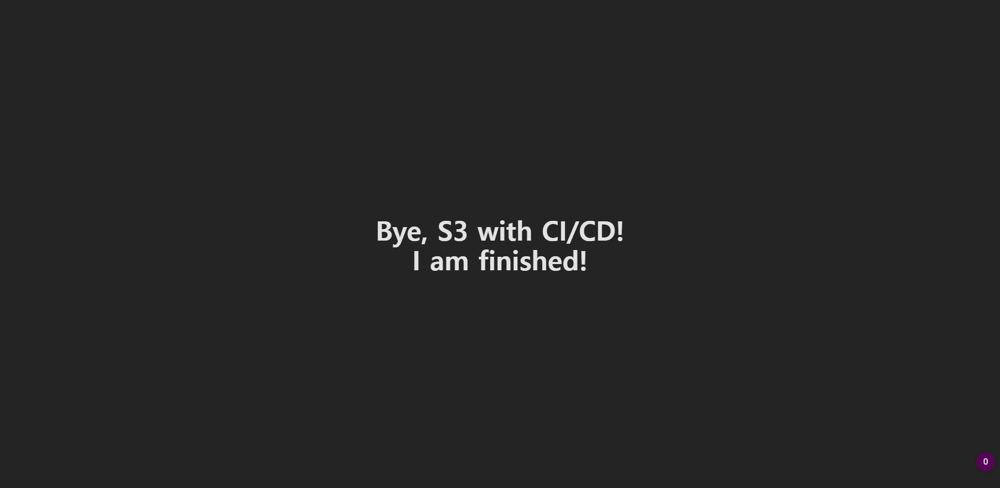

# [TIL 20] - [AWS] S3 CI/CD 자동화 with GitHub Actions

## 1. AWS CLI

[AWS S3 정적 사이트 배포](./02.md)에서 배포한 내용을 수정하면 어떻게 될까? 일반적으로 다음과 같은 과정을 거친다.

> 수정한 내용을 다시 빌드한다 -> S3에 올려둔 기존 파일을 삭제한다 -> 재빌드한 파일을 다시 업로드한다

과정이 단순해 보여도 매우 귀찮다. 빌드를 기다리고, 대시보드를 켜고, 클릭을 여러 번 하고... 등등. AWS에서는 이러한 과정을 자동화할 수 있도록 `CLI`를 제공한다. 먼저 [AWS CLI](https://aws.amazon.com/ko/cli/) 페이지에서 CLI 프로그램을 설치하자.

```shell
> aws --version
aws-cli/2.12.5 Python/3.11.4 Windows/10 exe/AMD64 prompt/off
```

### 1-1. configure

> 자세한 configure 명령어 설명은 [여기](https://docs.aws.amazon.com/cli/latest/reference/configure/index.html)를 참고한다.

버킷에 접근하는 명령어를 실행하려면 권한 있는 사용자임을 등록해야 한다. 레퍼런스를 보면 `ACCESS KEY`가 필요하다. 대시보드에서 프로필을 토글하여 `보안 자격 증명` 페이지로 이동한다.



아래에 있는 `액세스 키` 항목에서 엑세스 키 만들기를 클릭한다.



루트 키를 생성하는 것은 보안상 좋지 않다는 경고창이 보인다. 더 안전한 증명 방법이 있으니 이용하라는 이야기 같은데, 필자는 모르는 부분이라 일단 체크하고 넘어갔다.



최종 페이지에서 공개키와 비밀키 두 개가 생성된 것이 보인다. 이는 생성할 때 `최초로 한 번만` 확인할 수 있다. 까먹었을 때는 삭제하고 다시 생성하는 방법밖에 없으니, 어딘가에 잘 옮겨 두는 게 좋을 듯하다.

저장 후 레퍼런스를 따라 `aws configure`를 등록한다.

```shell
> aws configure
AWS Access Key ID [None]: accesskey
AWS Secret Access Key [None]: secretkey
Default region name [None]: us-west-2
Default output format [None]:
```

`region name`은 버킷을 생성할 때 등록한 지역의 코드를 입력한다. 버킷의 `속성` 탭에서 확인할 수 있다.

`aws configure list`를 통해 잘 등록되었는지 확인한다.

```shell
> aws configure list-profiles
default
```

`--profile`을 통해 이름을 등록하지 않은 최초 사용자인 `default`로 설정된다. 이후 추가로 등록한다면 `aws configure --profile <profile-name>`으로 구분할 수 있다.

### 1-2. S3 업로드

사용자 정보를 등록했으니 접근할 수 있는지 확인해 보자.

```shell
> aws s3 ls s3://try-hosting-s3-my-app
                           PRE assets/
2023-07-02 17:33:48        452 index.html
2023-07-02 17:33:49       1497 vite.svg
```

내 S3 버킷에 접근하여 올려둔 파일을 터미널에서 확인했다. cli도 잘 동작하고, 등록도 잘 되었다. 본격적으로 파일을 지우고 업로드하는 과정을 진행한다.

```shell
> aws s3 sync dist/ s3://try-hosting-s3-my-app --delete

delete: s3://try-hosting-s3-my-app/assets/index-27b21f2c.js
upload: dist\assets\index-d526a0c5.css to s3://try-hosting-s3-my-app/assets/index-d526a0c5.css
upload: dist\index.html to s3://try-hosting-s3-my-app/index.html
upload: dist\assets\index-46cd5a4f.js to s3://try-hosting-s3-my-app/assets/index-46cd5a4f.js
```

`sync` 명령어는 `dist/`의 내용과 내 버킷의 내용을 일치시키겠다는 명령어로, 즉 파일 업로드이다. `--delete`는 업로드 전 기존의 파일을 지우겠다는 옵션이다.

이전에는 랜딩 페이지에 `Hello, World`가 있었지만, 수정한 파일은 `Hello, S3`가 적혀 있다.



여기까지의 과정을 정리하면 `build -> aws upload`가 된다. 이것을 스크립트 명령어로 만들어 `package.json`의 `scripts`에 등록하자.

```json
// package.json
{
  // (...)
  "scripts": {
    // (...)
    "deploy": "npm run build && aws s3 sync dist/ s3://try-hosting-s3-my-app --delete"
  }
}
```

이것으로 자동화의 첫 번째 목적인 명령어 설정을 마쳤다.

> windows 환경에서는 업로드 후 다음과 같은 에러를 마주할 수 있다.
>
> ```
> Failed to load module script: Expected a JavaScript module script but the server responded with a MIME type of "text/plain". Strict MIME type checking is enforced for module scripts per HTML spec.
> ```
>
> 검색해 보니 `windows`는 `js`파일의 MIME 타입을 `text/plain`으로 등록해 놓았기 때문에 `aws`와 충돌하는 것이었다. 아래의 블로그를 참고하여 해결했다.
>
> [windows에서 배포 후 에러 해결 참고](https://nenara.com/276?category=868195)

### 1-TL;DR

- `aws cli` 설치
- `보안 자격 증명`에서 액세스 키 발급 후 `aws configure` 등록
- `aws s3 sync <build-path> s3://<your-bucket-name> --delete`로 수정된 빌드 파일 업로드

## 2. AWS S3 CI/CD 파이프라인 구축

### 2-1. CI/CD

`CI`는 `Continuous Integration(지속적인 통합)`의 약자이며, 말그대로 코드를 지속적으로 통합하는 것을 의미한다. 단순히 PR을 통하여 코드를 합치는 것 뿐만 아니라 코드 테스트, 유효성 검사 등의 세세한 확인까지 포함한다. 예를 들어, 테스트 과정에서 에러가 발견되면 배포를 중단하거나, 배포 과정 중 에러 발생 시 즉각적인 피드백이 가능하도록 구성하는 것이다.

`CD`는 `Continuous Deployment(지속적인 배포)` 또는 `Continuous Delivery(지속적인 전달)`의 약자이다. `CI`를 통해 성공적으로 통합된 서비스를 실제 사용자가 사용할 수 있도록 **Production** 환경에 배포하는 것의 자동화를 의미한다. 조금 더 자세하게 구분하자면, 전자(`Deployment`)의 경우 **Production**까지의 배포 자동화를 말하고, 후자(`Delivery`)는 **Development**까지의 배포 자동화를 가리킨다.

`CI/CD`를 구축하는 것은 관리나 비용 측면에서 단점이 발생한다. 그럼에도 구축하는 이유는 **효율**적인 면에서 유리하기 때문이다. 수동 배포에 쏟는 자원을 줄여 빠르게 변경되는 서비스 개발에 더 투입하는 것이 생산성을 더 높일 수 있다.

### 2-2. GitHub Actions

**GitHub Actions**는 `GitHub`에서 제공하는 클라우드형 CI/CD 도구이다. 당연히 GitHub 레포와 연동이 쉽고, 그 안에서 CI/CD 파이프라인을 구축하여 운영할 수 있다.

### 2-3. GitHub Actions 구성요소

1. Workflow
   - 자동화되어 실행될 작업 흐름
   - `YAML` 형식을 통해 설정
   - 이벤트나 예약에 따라 스케줄 실행 가능하며, 수동 조작 허용
2. Event
   - 레포에서 발생하는 `push`, `PR open`, `issue open` 등의 특정한 활동
   - 특정 이벤트 발생 시 그에 맞는 파이프라인 구동 가능
3. Jobs
   - 하나의 `runner`에서 실행될 `step` 모음
   - `step`은 실행 가능한 `shell script`나 `action` 의미
   - 하나의 `workflow` 안에서 여러 `job` 설정 가능
   - 기본적으로 병렬 실행
   - `job` 간의 의존성을 설정하여 실행 서순 조정 가능
4. ACtions
   - `workflow`에서 자주 사용되는 기능을 모아둔 것
   - `use` 키워드와 함께 사용 가능
   - `GitHub Marketplace`에서 Action들을 검색하고 활용 가능
5. Runner
   - `workflow` 실행 서버
   - 가상의 `runner`를 통해 `workflow` 실행
   - 기본적으로 `node v16` 탑재

### 2-4. CI/CD 구축

실제로 `GitHub Actions`를 사용하여 CI/CD 파이프라인을 구축해 보자. 먼저 실행 파일인 `yml`을 생성한다. `.github/workflows/<file>.yml` 경로로 생성하면 `GitHub Actions`가 해당 파일을 인식하고 workflow를 실행한다.

파이프라인의 목적은 다음과 같다.

1. `main` 브랜치에 push or merge되면 workflow 실행
2. dependencies 설치
3. 빌드 실행
4. AWS S3 업로드

#### 2-4-1. `main` 브랜치에 push or merge되면 workflow 실행

```yml
# workflow 이름
name: S3-CICD

# 실행될 이벤트 등록
on:
  push:
    branches:
      - main

# 실행될 작업 목록
jobs:
  # 작업 이름
  cicd:
    # 작업을 실행해 줄 서버
    runs-on: ubuntu-latest
    # 실행 단계
    steps:
      - run: 'echo "Hello, Github Actions"'
```

기본적인 `yml` 파일을 생성했다. `main` 브랜치에 `push`하면 actions가 실행된다.



테스트로 푸시한 결과물이다. `'echo "Hello, Github Actions"'` 명령어가 실행된 것이 보인다. 정상 동작을 확인했으니 추가 스크립트를 작성하자.

#### 2-4-2. dependencies 설치

빌드하기 위해서는 당현히 서버에도 사용한 라이브러리 등이 있어야 한다. `npm ci`로 설치되도록 스크립트를 추가한다.

```yml
# ...

# 실행될 작업 목록
jobs:
  # 작업 이름
  cicd:
    # 작업을 실행해 줄 서버
    runs-on: ubuntu-latest
    # 실행 단계
    steps:
      - run: "npm ci"
```

> `npm ci`는 `npm install`처럼 패키지를 설치하지만, 몇 가지 차이점이 있다.
>
> - `package-lock.json`을 참고한다.
> - 기존의 `node_modules`를 지우고 설치한다.
> - `package.json`과 버전이 다르면 에러를 발생시킨다.
>
> 참고 : [npm install vs npm ci :: 마이구미](https://mygumi.tistory.com/409)

#### 2-4-3. 빌드 실행

의존성 설치 다음 `npm run build`를 실행하도록 스크립트를 추가한다.

```yml
# ...

# 실행될 작업 목록
jobs:
  # 작업 이름
  cicd:
    # 작업을 실행해 줄 서버
    runs-on: ubuntu-latest
    # 실행 단계
    steps:
      - run: "npm ci"
      - run: "npm run build"
```

#### 2-4-4. AWS S3 업로드

문제는 여기다. 로컬에서 `configure`를 진행했듯이 actions의 서버에서도 인증 절차를 진행해야 한다. 설정 파일은 공개되어 있으므로 액세스 키를 직접 적을 수 없다. 분명 방법이 있겠지만 쉽지 않을 것이다.

이런 부분에서 사용할 수 있도록 라이브러리처럼 actions도 **Marketplace**라는 곳을 통해 편의성을 제공한다. 여기서 필요한 `AWS S3`를 검색한다. 많은 게 나와 무엇을 선택할지 고민될 수 있다. 배운 꿀팁에 의하면, `most installed/starred` 순으로 정렬하여 가장 위에 있는 것을 고른다. 라이브러리 선택과 비슷한 느낌이랄까?



가장 많은 별을 받은 `checkout`과 `S3 Sync`를 참고했다.

```yml
- uses: actions/checkout@v3
  with:
    ref: main
- uses: jakejarvis/s3-sync-action@master
  with:
    args: --delete
  env:
    AWS_S3_BUCKET: ${{ secrets.AWS_S3_BUCKET }}
    AWS_ACCESS_KEY_ID: ${{ secrets.AWS_ACCESS_KEY_ID }}
    AWS_SECRET_ACCESS_KEY: ${{ secrets.AWS_SECRET_ACCESS_KEY }}
    AWS_REGION: "ap-northeast-2"
    SOURCE_DIR: "dist"
```

Actions에서 제공한 코드를 참고하되 필요한 사양에 맞춰 수정한다. 일단 내 레포에 맞춰 `actions/checkout@v3`의 `ref`를 `main`으로 변경했다.
`aws cli` 명령어에서 사용할 옵션은 `--delete`뿐이므로 해당 옵션만 남겼다.
`AWS_REGION`은 버킷과 같은 지역 코드로, `SOURCE_DIR`도 빌드 결과물 폴더로 변경한다.

**secrets**는 개발 환경에서의 *환경 변수*와 비슷하다. 레포의 `Settings -> Secrets and variables -> Actions`에서 설정한다.



`New repository secrete`을 클릭해 키-값을 넣는다. 키는 사용한 Actions에서 제공한 키를 넣고, 값은 그에 맞는 자신의 값들을 넣는다. 키만 봐도 알 수 있으니 적절히 넣도록 하자. 주의할 점은, 이 역시 등록할 때를 제외하고 다시 볼 수 없다는 것이다. 수정과 삭제만 가능하다.



#### 2-4-5. Actions 전체 코드

```yml
# workflow 이름
name: S3-CICD

# 실행될 이벤트 등록
on:
  push:
    branches:
      - main
  # 수동으로 실행
  workflow_dispatch:

# 실행될 작업 목록
jobs:
  # 작업 이름
  cicd:
    # 작업을 실행해 줄 서버
    runs-on: ubuntu-latest
    # 실행 단계
    steps:
      # 해당 스텝의 이름과 과정
      - name: "checkout branch"
        uses: actions/checkout@v3
        with:
          ref: main
      - name: "run clean install"
        run: npm ci
      - name: "run build"
        run: npm run build
      - name: "deploy to s3"
        uses: jakejarvis/s3-sync-action@master
        with:
          args: --delete
        env:
          AWS_S3_BUCKET: ${{ secrets.AWS_S3_BUCKET }}
          AWS_ACCESS_KEY_ID: ${{ secrets.AWS_ACCESS_KEY_ID }}
          AWS_SECRET_ACCESS_KEY: ${{ secrets.AWS_SECRET_ACCESS_KEY }}
          AWS_REGION: "ap-northeast-2"
          SOURCE_DIR: "dist"
```

### 2-TL;DR

- 레포 내에 `.github/workflows/<name>.yml` 파일에 CI/CD 코드 작성
- 필요한 `secrets`를 레포의 `Settings -> Secrets and variables -> Actions`에 저장
- **Marketplace**를 참고하여 추가적인 과정을 진행

## 3. 결과

```jsx
import "./App.css";

function App() {
  return (
    <h1>
      Bye, S3 with CI/CD!
      <br />I am finished!
    </h1>
  );
}

export default App;
```

내용을 다음과 같이 수정하여 푸시해 보았다.



두근두근한 빌드 및 배포 과정이 정상적으로 종료되었다. 에러가 없어서 다행이다.



의도한 대로 수정되어 잘 나타난다!
