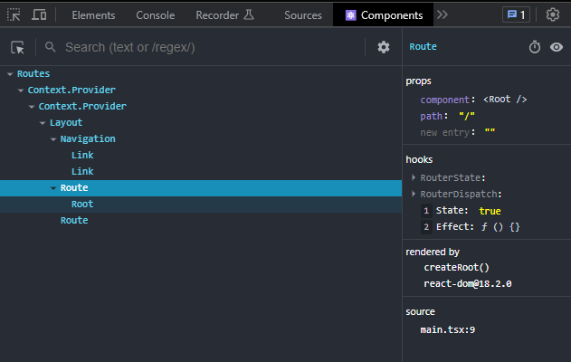

# [TIL 21] - [React] 라이브러리 없이 SPA 구현 리팩토링

**프리온보딩 챌린지 FE 7월** 과제로 라이브러리 없이 SPA 라우터를 구현했다. 잘 동작하길래 만족했더니 함정이 숨어 있었다. 과제에서 제시한 대로만 구현하면 불필요한 마운트가 생긴다.



구현하면서 현재 `Root`에 있다면 렌더링하지 않은 `About` 라우트는 나타나지 않기를 기대했다. 숨겨진 진실(?)을 확인하니 많이 당황스러웠다.

피드백 내용과 제공해준 블로그 내용을 바탕으로 코드를 수정했다.

## 문제 1. `Route` 내에서 렌더링 로직 실행

현재 url의 pathname과 요청한 path가 같으면 컴포넌트가 렌더링된다. 이 로직은 `Route`에서 실행되었다.

```tsx
const Route = ({ path, component }: RouteProps) => {
  const pathname = useRouterState();
  const setPathname = useRouterDispatch();
  const [isCurrentPath, setIsCurrentPath] = useState(false);

  useEffect(() => {
    setIsCurrentPath(path === pathname ? true : false);

    const handlePopstate = () => {
      setPathname(window.location.pathname);
      return;
    };

    window.addEventListener("popstate", handlePopstate);

    return () => window.removeEventListener("popstate", handlePopstate);
  }, [pathname]);

  return isCurrentPath ? component : null;
};
```

얼핏 보면 현재 경로와 같을 때 `component`를 반환하고, 아닐 경우 `null`을 반환하니 잘 동작할 것 같다. 그러나 이는 `Route`의 하위 컴포넌트를 결정하는 것이고, 어쨌든 `null`도 객체이니 `Route`는 존재하는 컴포넌트로 마운트된다.

게다가 `useEffect`까지 사용하여 렌더링되라고 주문을 외웠으니 남지 않기를 바라는 게 욕심이었다.

내가 바라는 결과는 현재 경로의 `Route`를 제외한 나머지는 마운트하지 않는 것이다. 일단 **로직부터 제거**했다.

```tsx
interface RouteProps {
  path: string;
  component: ReactElement;
}

const Route = (props: RouteProps) => {
  return <>{props.component}</>;
};
```

이제 `Route`는 렌더링 페이지 컴포넌트를 담는 깡통이 되었다.

## 2. 제거한 로직 위치 변경

경로 처리 로직은 필요하니 어딘가에 넣어야 하는데 처음에는 `routeContext`인 `Routes`에서 처리하려고 했다. 실제로 코드를 작성해 실행해 봐도 아무런 탈 없이 잘 굴러갔다. 그러나 `pathname`의 상태관리를 위해 작성한 context에서 모든 로직을 처리해도 되나? 하는 의문점이 생겼다. 최근 **관심사 분리**에 대해 들었기 때문이었다. 선행한 분의 블로그에도 그런 이유로 처리 로직을 분리했다고 한다.

여기서 `Router`와 `Route`로 구현하라고 했었구나, 하는 작은 깨달음을 얻었다. 나는 그게 그거려니 생각해 대충 `Routes`와 `Route`로 나눴었다. 그러니 다시 중간 매개체를 고려해야 하는 문제가 발생했다.

`routeContext`는 `Router`로 수정하고, 로직을 담당하는 `Routes`를 새로 생성했다.

처리 방안을 모색했던 컴포넌트와 path를 검증하는 로직을 `Routes`에서 처리했다.

```tsx
const Routes = ({ children }: RoutesProps) => {
  const pathname = useRouterState();
  const setPathname = useRouterDispatch();

  /* 추가 */
  const isCurrentPathComponent = (
    component: ReactElement<{ path: string }>
  ) => {
    return pathname === component.props.path;
  };
  /* **** */
  useEffect(() => {
    const handlePopstate = () => {
      setPathname(window.location.pathname);
      return;
    };

    window.addEventListener("popstate", handlePopstate);

    return () => window.removeEventListener("popstate", handlePopstate);
  }, [pathname]);

  return <>{children.find(isCurrentPathComponent) ?? <NotFound />}</>;
};
```

`children`에서 `url pathname`과 컴포넌트의 `path`가 일치하는지 검증하는 함수 `isCurrentPathComponent`를 추가했다. 반환하는 컴포넌트는 `children`을 순회하면서 `true`인 값인 하위 `Route`만 렌더링한다. 추가로 잘못된 페이지 접근도 처리했다.

## 3. Route가 하나인 경우 처리

그러나 한 가지 미스가 또 있었다. 항상 `Route`가 여러 개 들어올 거라는 확신이었다. `children`의 타입을 `ReactElemental[]`로 선언했는데, 모종의 이유로 `Route`를 하나만 입력하면 에러가 발생한다. `children`이 배열인지 확인하고, 아닐 경우 배열로 바꿔주는 코드를 추가했다.

```tsx
const childrenArray = Array.isArray(children) ? children : [children];
```

이제 불필요한 `Route`를 마운트하지 않으면서 원하는 대로 동작한다.

## 4. isValidElement ?

`React`에서 제공해주는 함수 중 `isValidElement`는 값이 React 엘리먼트인지 확인하여 boolean을 반환한다.

> `isValidElement`
> isValidElement checks whether a value is a React element.
> isValidElement는 값이 React 엘리먼트인지 확인합니다.

선행하신 분의 글에 나와 있어서 이걸 왜 사용했나 고민했다. 없어도 잘 굴러가던데……. React 엘리먼트가 아닌 것이 들어오는 경우도 있나?

나의 경우 타입 선언 자체를 `ReactElement`로 선언하여 아무런 문제가 없는데, 만약 `ReactNode`로 선언한 경우 검증이 필요할 수 있다.

```tsx
const isCurrentPathComponent = (component: ReactNode) => {
  if (!isValidElement(component)) {
    return false;
  }
  return pathname === component.props.path;
};
```

`ReactNode`는 다양한 속성으로 이루어져 있다.

```ts
type ReactNode =
  | ReactElement
  | string
  | number
  | Iterable<ReactNode>
  | ReactPortal
  | boolean
  | null
  | undefined;
```

만약 `isValidElement`를 통과하지 못하면 저 중 어떠한 속성인지 `TypeScript`는 알지 못한다. 통과하면 저 속성 중 `ReactElement`이므로 `props`에 접근할 수 있다.

지금처럼 간단하고 확실한 경우에는 직접 타입과 제네릭을 선언해도 되지만, 더 복잡한 경우에는 아주 유용한 함수일 것 같다.

---

**참고**\
[React Router를 직접 만들어보는 과정](https://ghoon99.tistory.com/91)
